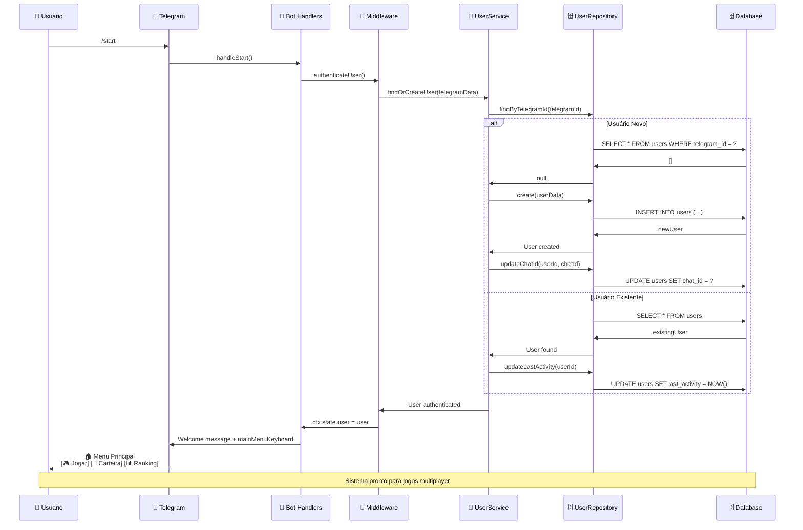
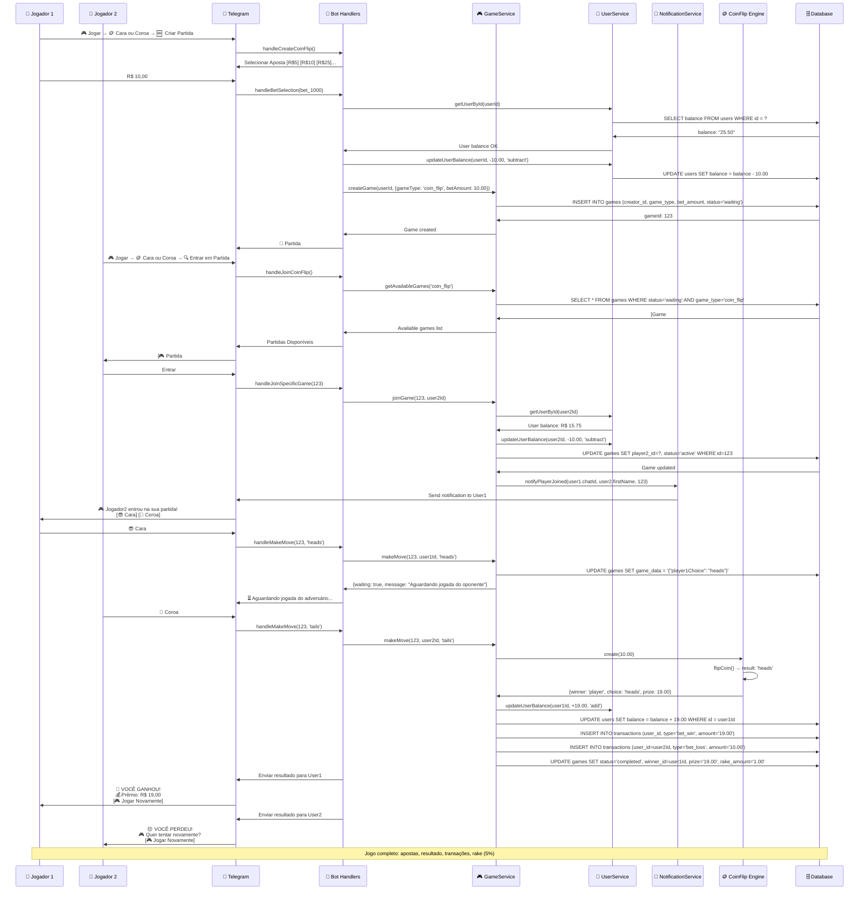
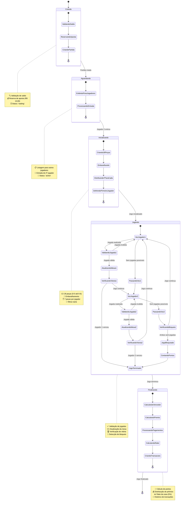
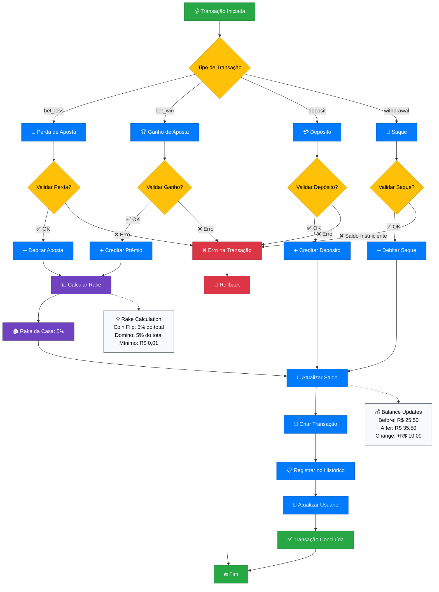
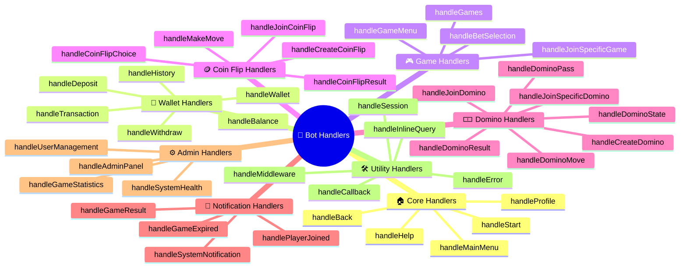
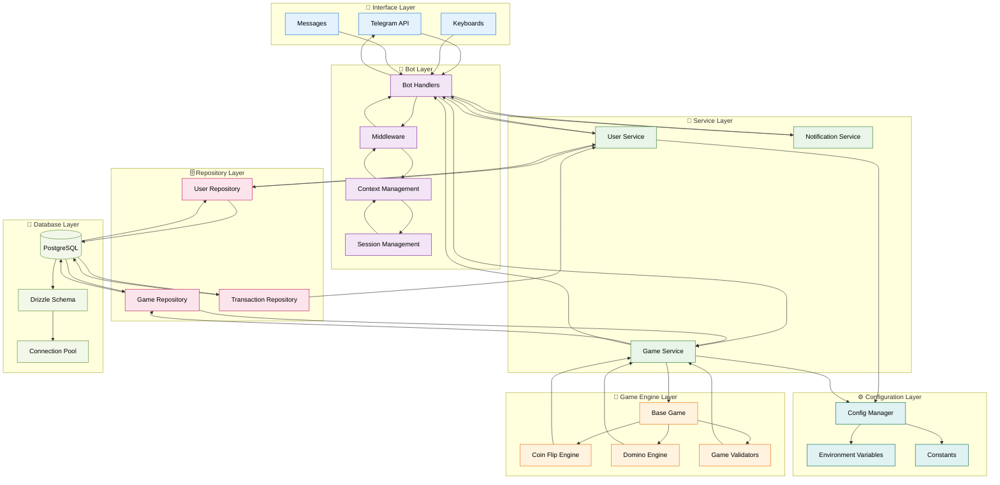
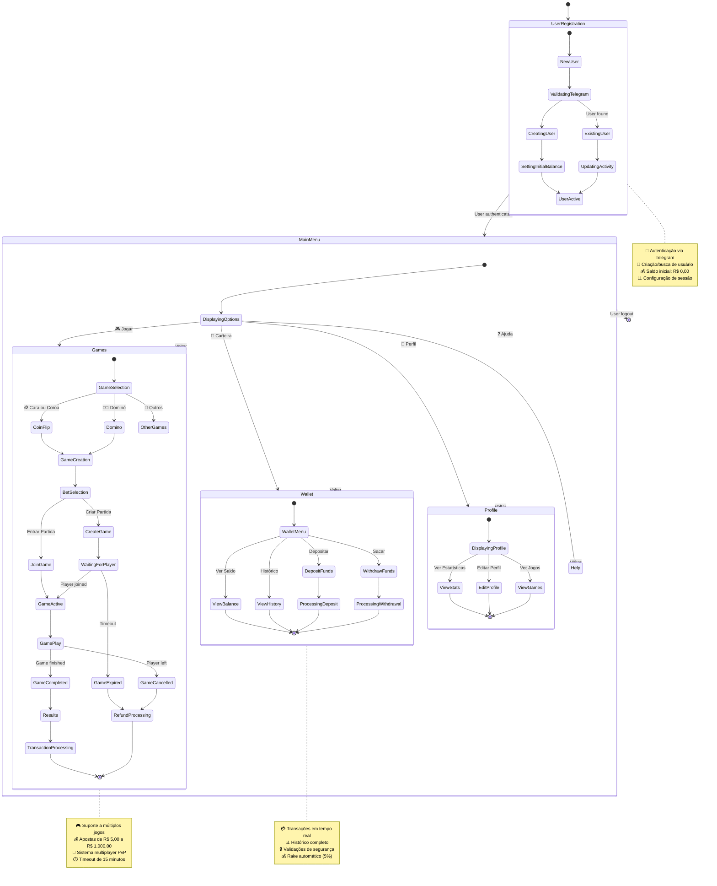
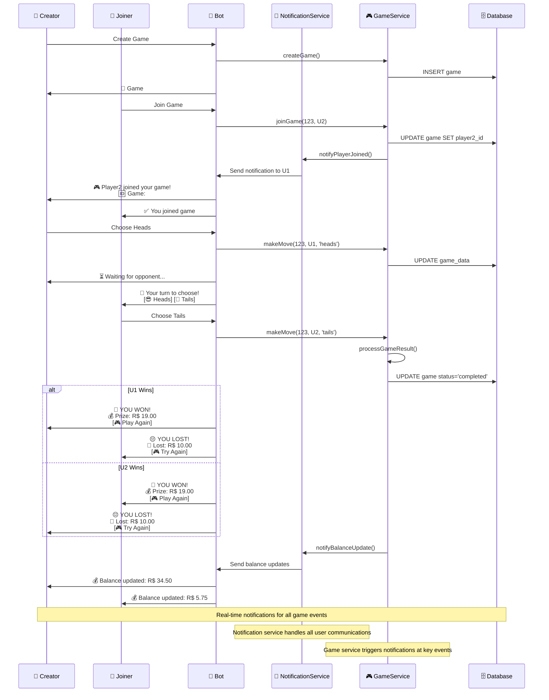

# 🔄 Fluxos da Aplicação - Diagramas Detalhados

## 📋 Índice
1. [Fluxo de Inicialização Completo](#1-fluxo-de-inicialização-completo)
2. [Fluxo Coin Flip Multiplayer](#2-fluxo-coin-flip-multiplayer)
3. [Fluxo Domino Detalhado](#3-fluxo-domino-detalhado)
4. [Sistema de Transações](#4-sistema-de-transações)
5. [Mapa de Handlers](#5-mapa-de-handlers)
6. [Arquitetura de Dados](#6-arquitetura-de-dados)
7. [Estados de Sistema](#7-estados-de-sistema)
8. [Notificações em Tempo Real](#8-notificações-em-tempo-real)

---

## 1. Fluxo de Inicialização Completo

---

## 2. Fluxo Coin Flip Multiplayer

---

## 3. Fluxo Domino Detalhado

---

## 4. Sistema de Transações

---

## 5. Mapa de Handlers

---

## 6. Arquitetura de Dados

---

## 7. Estados de Sistema

---

## 8. Notificações em Tempo Real

---

## 📊 Resumo dos Fluxos

### 🎯 **Características Principais:**
- **Sistema Multiplayer PvP**: Coin Flip e Domino com oponentes reais
- **Notificações em Tempo Real**: Avisos instantâneos para todas as ações
- **Transações Automáticas**: Processamento seguro de apostas e prêmios
- **Estado Persistente**: Jogos podem ser pausados e retomados
- **Rake Automático**: 5% de comissão da casa calculada automaticamente

### 🎮 **Jogos Implementados:**
- **🪙 Coin Flip**: Multiplayer PvP, 1.95x payout, resultado instantâneo
- **🀱 Domino**: Multiplayer PvP, 1.9x payout, múltiplas rodadas, estado complexo
- **🔜 Em Desenvolvimento**: Dados, Pedra-Papel-Tesoura, Torneios

### 🔧 **Tecnologias:**
- **Backend**: Node.js + TypeScript + Telegraf.js
- **Database**: PostgreSQL + Drizzle ORM
- **Architecture**: Clean Architecture + Repository Pattern
- **Validation**: Zod schemas + middleware
- **Logging**: Winston + structured logging

### 📊 **Estatísticas:**
- **32+ Bot Handlers** documentados e funcionais
- **3 Services principais** (User, Game, Notification)
- **3 Repositories** (User, Game, Transaction)
- **2 Game Engines** completamente implementados
- **5 tipos de transação** (bet_win, bet_loss, deposit, withdrawal, rake)
- **Sistema de rake 5%** implementado automaticamente

### 💰 **Sistema Financeiro:**
- **Apostas**: R$ 5,00 a R$ 1.000,00
- **Rake**: 5% automático em todos os jogos
- **Transações**: Tempo real com histórico completo
- **Validações**: Saldo, limites, timeouts

---

*📝 Documentação gerada automaticamente - Baseada na análise completa do código*
*🔄 Última atualização: Janeiro 2025*
