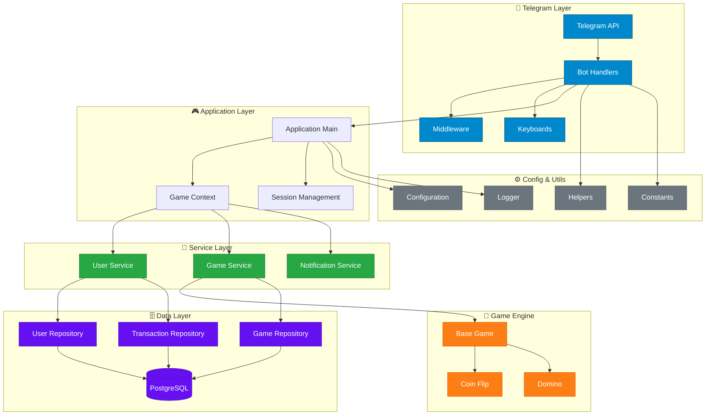
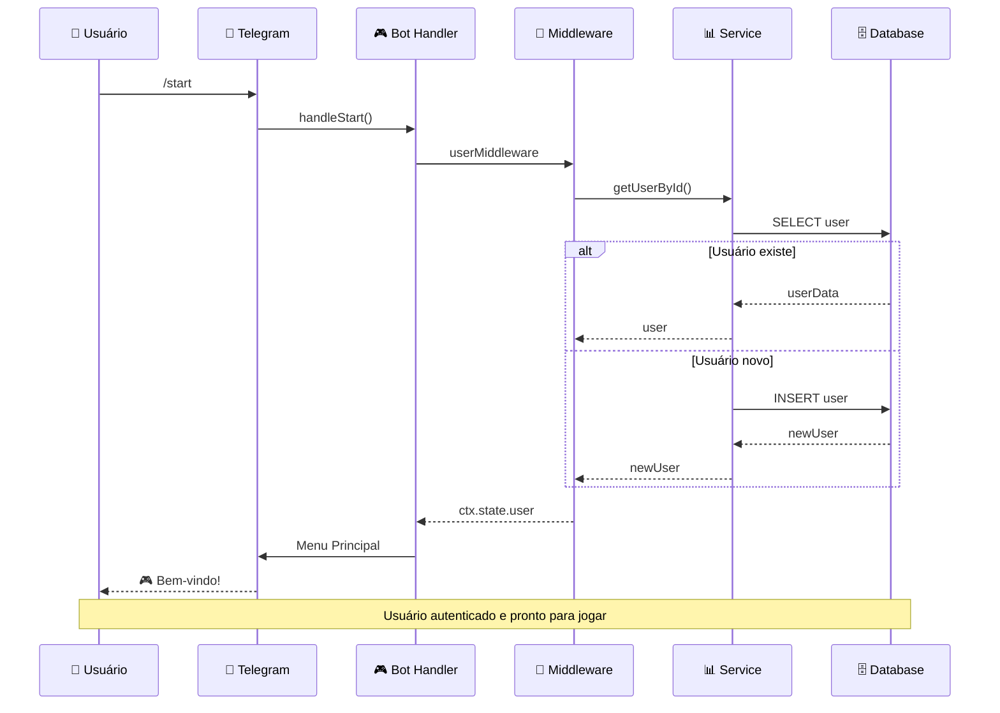
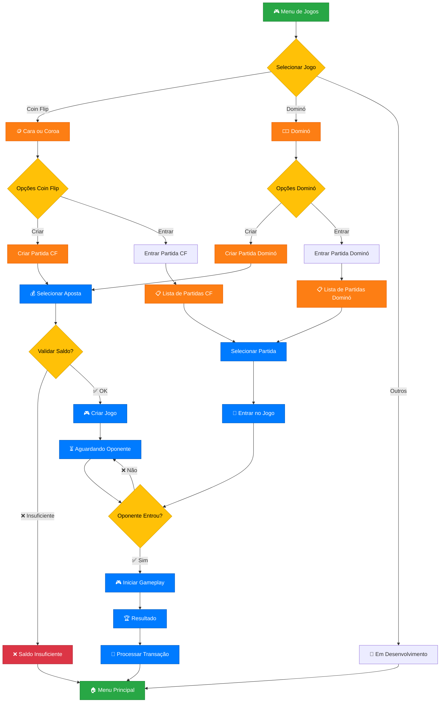
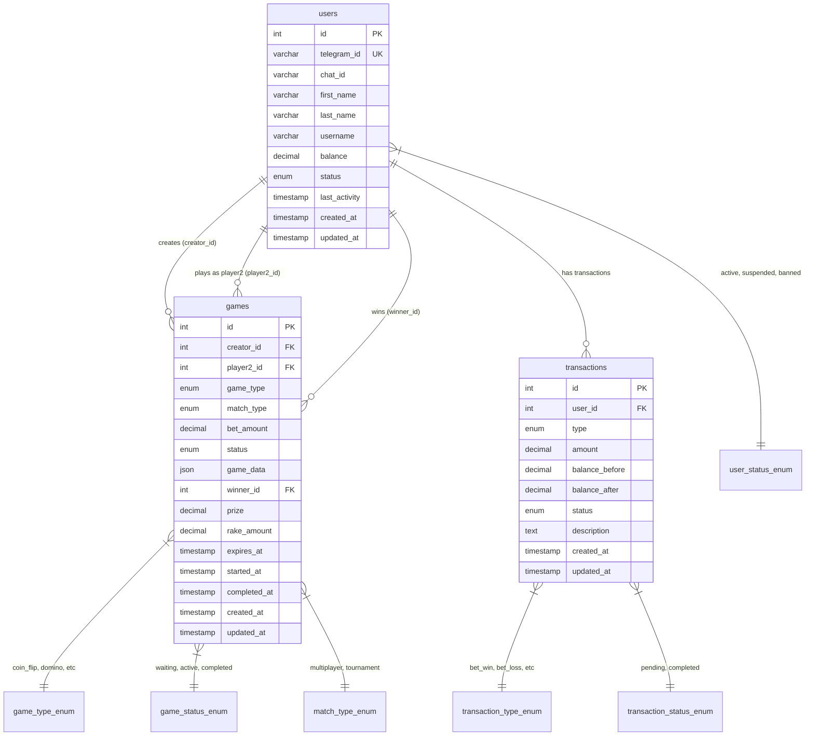
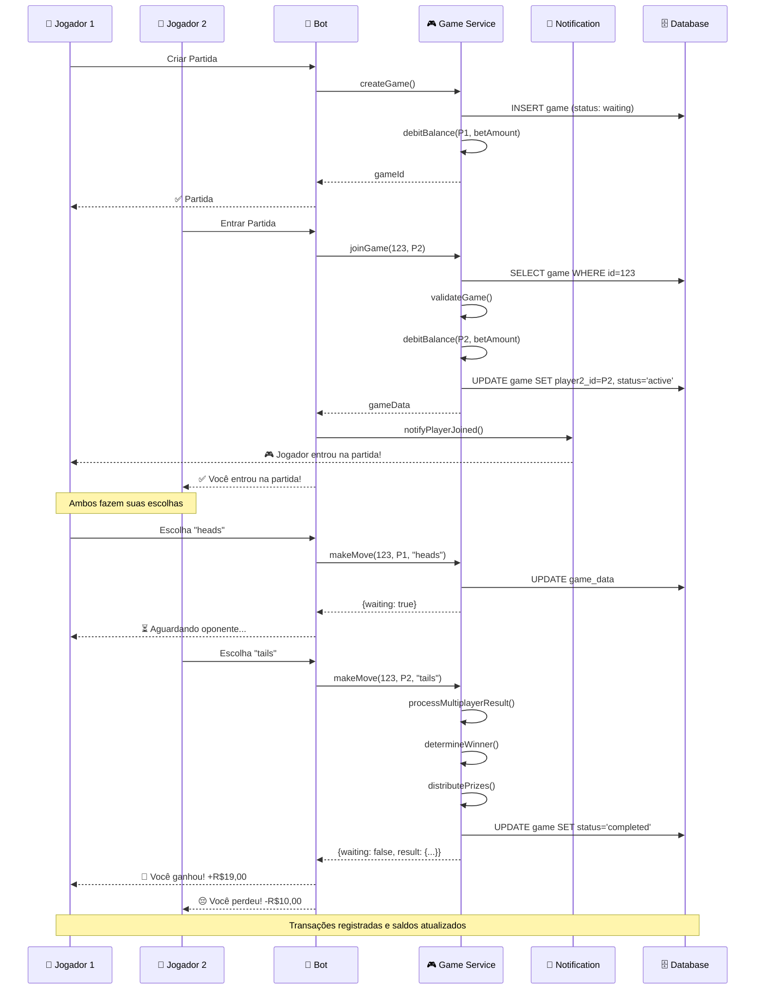
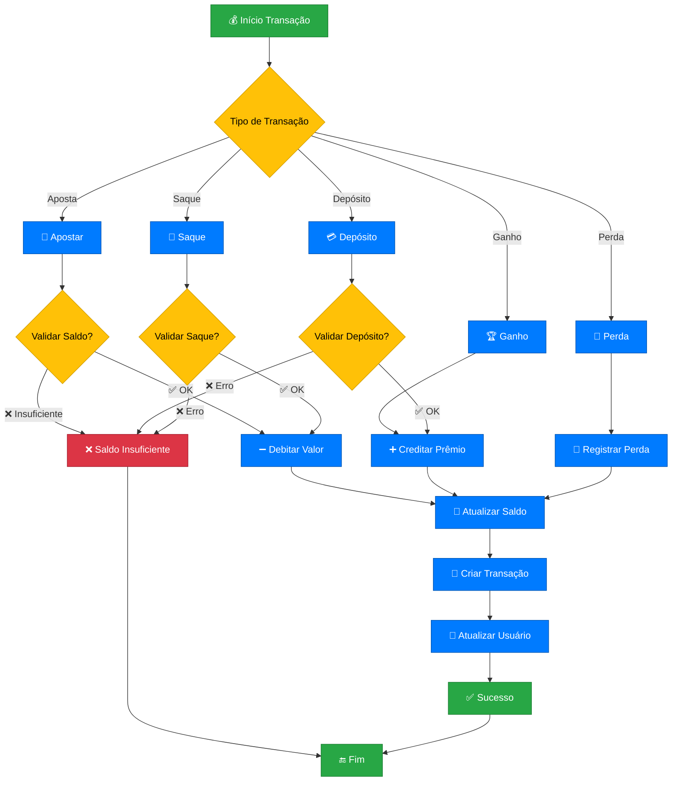
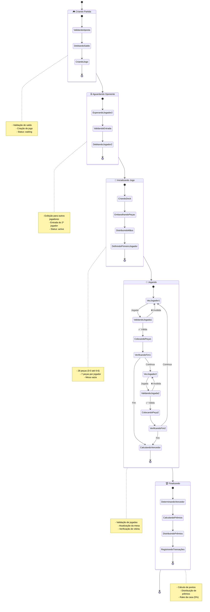
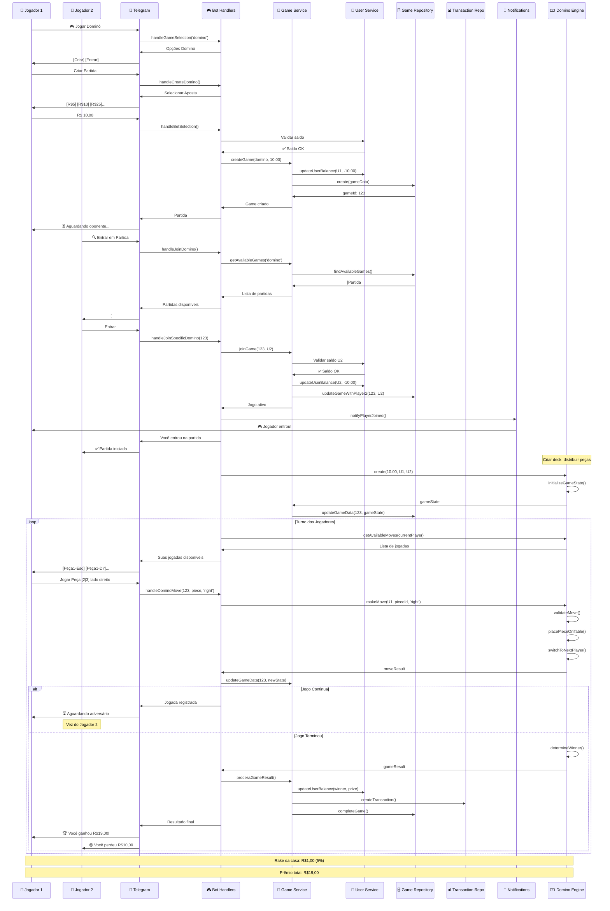
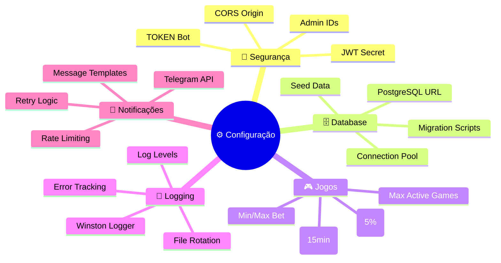

# 🏗️ Arquitetura do Sistema - Diagramas Mermaid

## 📋 Índice
1. [Arquitetura Geral](#1-arquitetura-geral)
2. [Fluxo de Usuário](#2-fluxo-de-usuário)
3. [Sistema de Jogos](#3-sistema-de-jogos)
4. [Banco de Dados](#4-banco-de-dados)
5. [Bot Telegram](#5-bot-telegram)
6. [Fluxo Multiplayer](#6-fluxo-multiplayer)
7. [Sistema de Transações](#7-sistema-de-transações)
8. [Jogo Dominó](#8-jogo-dominó)

---

## 1. Arquitetura Geral



---

## 2. Fluxo de Usuário



---

## 3. Sistema de Jogos



---

## 4. Banco de Dados



---

## 5. Bot Telegram

```mermaid
graph LR
    subgraph "📱 User Interface"
        USER[👤 Usuário]
        TG[📱 Telegram App]
    end

    subgraph "🤖 Bot Layer"
        HANDLERS[🎮 Bot Handlers]
        KEYBOARDS[⌨️ Keyboards]
        CONTEXT[📝 Context]
        MIDDLEWARE[🔧 Middleware]
    end

    subgraph "🎯 Handler Types"
        START[/start]
        HELP[/help]
        PROFILE[/profile]
        CALLBACKS[📞 Callbacks]
        ACTIONS[⚡ Actions]
    end

    subgraph "⌨️ Keyboard Types"
        MAIN[🏠 Main Menu]
        GAMES[🎮 Games Menu]
        WALLET[💼 Wallet Menu]
        BETS[💰 Bet Selection]
        CHOICES[🎯 Game Choices]
    end

    subgraph "🔧 Middleware Flow"
        AUTH[🔐 Authentication]
        USER_LOAD[👤 Load User]
        SESSION[📊 Session Management]
        LOGGING[📝 Logging]
    end

    USER --> TG
    TG --> HANDLERS
    HANDLERS --> KEYBOARDS
    HANDLERS --> CONTEXT
    HANDLERS --> MIDDLEWARE

    HANDLERS --> START
    HANDLERS --> HELP
    HANDLERS --> PROFILE
    HANDLERS --> CALLBACKS
    HANDLERS --> ACTIONS

    KEYBOARDS --> MAIN
    KEYBOARDS --> GAMES
    KEYBOARDS --> WALLET
    KEYBOARDS --> BETS
    KEYBOARDS --> CHOICES

    MIDDLEWARE --> AUTH
    AUTH --> USER_LOAD
    USER_LOAD --> SESSION
    SESSION --> LOGGING

    %% Return flows
    LOGGING --> CONTEXT
    CONTEXT --> HANDLERS
    HANDLERS --> TG
    TG --> USER

    %% Styling
    classDef user fill:#17a2b8,stroke:#138496,color:#fff
    classDef bot fill:#28a745,stroke:#1e7e34,color:#fff
    classDef handler fill:#fd7e14,stroke:#e55a00,color:#fff
    classDef keyboard fill:#6f42c1,stroke:#563d7c,color:#fff
    classDef middleware fill:#dc3545,stroke:#a71d2d,color:#fff

    class USER,TG user
    class HANDLERS,KEYBOARDS,CONTEXT bot
    class START,HELP,PROFILE,CALLBACKS,ACTIONS handler
    class MAIN,GAMES,WALLET,BETS,CHOICES keyboard
    class AUTH,USER_LOAD,SESSION,LOGGING middleware
```

---

## 6. Fluxo Multiplayer



---

## 7. Sistema de Transações



---

## 8. Jogo Dominó



---

## 🔄 Fluxo Completo: Criação e Execução de Jogo



---

## 📊 Métricas e Estatísticas


---

## 🔧 Configuração do Sistema



---

## 📈 Fluxo de Desenvolvimento

```mermaid
gitgraph
    commit id: "Initial Setup"
    branch feature/bot-handlers
    commit id: "Basic Handlers"
    commit id: "Menu System"
    commit id: "User Management"
    checkout main
    merge feature/bot-handlers
    
    branch feature/game-engine
    commit id: "Base Game Class"
    commit id: "Coin Flip Game"
    commit id: "Domino Engine"
    checkout main
    merge feature/game-engine
    
    branch feature/services
    commit id: "User Service"
    commit id: "Game Service"
    commit id: "Notification Service"
    checkout main
    merge feature/services
    
    branch feature/database
    commit id: "Schema Design"
    commit id: "Repositories"
    commit id: "Migrations"
    checkout main
    merge feature/database
    
    commit id: "Integration Tests"
    commit id: "JSDoc Documentation"
    commit id: "Production Ready"
```

---

## 🎯 Próximos Passos

```mermaid
roadmap
    title Roadmap de Desenvolvimento
    
    section Atual (v1.0)
        Coin Flip Multiplayer     : done, coinflip, 2024-01-01, 2024-01-15
        Domino Multiplayer        : done, domino, 2024-01-10, 2024-01-30
        Sistema de Transações     : done, transactions, 2024-01-05, 2024-01-20
        Bot Telegram              : done, bot, 2024-01-01, 2024-01-25
        
    section Próxima (v1.1)
        Pedra/Papel/Tesoura      : active, rps, 2024-02-01, 2024-02-15
        Sistema de Dados         : dice, 2024-02-10, 2024-02-25
        Histórico de Jogos       : history, 2024-02-05, 2024-02-20
        
    section Futura (v2.0)
        Sistema de Torneios      : tournament, 2024-03-01, 2024-03-30
        Rankings e Leaderboards  : ranking, 2024-03-15, 2024-04-01
        Sistema de Depósito/Saque: payments, 2024-04-01, 2024-04-30
        API REST                 : api, 2024-04-15, 2024-05-15
```

---

## 📋 Resumo da Arquitetura

### 🏗️ **Características Principais:**
- **Arquitetura em Camadas**: Separação clara entre apresentação, serviços e dados
- **Sistema Multiplayer**: Jogos PvP em tempo real
- **Gestão de Estado**: Persistência de jogos complexos (Dominó)
- **Transações Seguras**: Sistema robusto de apostas e prêmios
- **Escalabilidade**: Estrutura preparada para novos jogos

### 🎮 **Jogos Implementados:**
- ✅ **Coin Flip**: Cara ou Coroa multiplayer
- ✅ **Domino**: Jogo complexo com 28 peças
- 🔄 **Outros**: Em desenvolvimento

### 🔧 **Tecnologias:**
- **Backend**: Node.js + TypeScript
- **Database**: PostgreSQL + Drizzle ORM
- **Bot**: Telegraf.js
- **Logger**: Winston
- **Validation**: Zod

### 📊 **Métricas:**
- **85%** de implementação completa
- **32** handlers do bot documentados
- **3** serviços principais
- **3** repositórios de dados
- **2** jogos multiplayer funcionais

---

*📝 Documentação gerada automaticamente - Última atualização: Janeiro 2025*
